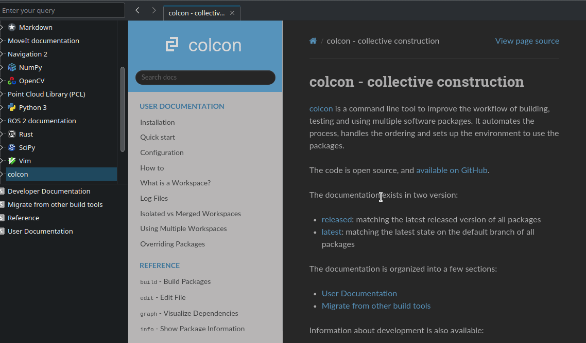

# ROS Docsets

Newest snapshot: 2022.12.13



Docsets to use in Dash/Zeal. These allow you to browse documentation for ROS (specifically for ROS Humble/Rolling). Sadly, no automation yet, all of those were compiled manually with the use of few scripts, if there's interest I might add automatic generation.
## How to use

To use with Zeal, download the repo, and put directories from `docsets` directory in `~/.local/share/Zeal/Zeal/docsets`
Note, Zeal needs to be restarted if already running.

## Available docs
* colcon
* launch
* Moveit2 
* Naviagtion2
* rclcpp
* rclpy
* main ros documentation
* ros_core

## Recreating

For tools like Moveit2, Navigation2 and colcon one only has to download latest docs source and use `doc2dash` after building ROS.

For libraries such as rclcpp, rclpy,launch etc. it's a little bit more complicated.
First, run `build_docs.sh`. Then for each directory that you want (provided it generated documentation) run `doxygen2docset`

Example

```
build_docs.sh -r humble
```

```
doxygen2docset --doxygen /tmp/tmp.z0rJ443ajE/src/ros2/rclcpp/rclcpp/doc_output/html --docset ~/rclcpp_docset
```

Note that the main directory name (in this case `tmp.z0rJ443aJe`) is generated randomly 
You might also need to edit manually `Info.plist` file inside `Contents` directory to set proper name for the docs.

Links:

https://github.com/ros2/docs.ros2.org/tree/doc_gen
https://github.com/chinmaygarde/doxygen2docset
https://pypi.org/project/doc2dash/


